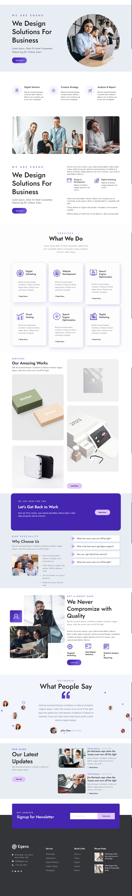

# Egens landing page

simple html,css,bootstrap 5 

###Demo

# Landing Page for Design Agency

Welcome to the repository for our Design Agency Landing Page! This project showcases a modern and responsive website designed to highlight our services, client testimonials, and portfolio.

## Table of Contents

- [Features](#features)
- [Technologies Used](#technologies-used)
- [Installation](#installation)
- [Usage](#usage)
- [Contributing](#contributing)

## Features

- **Responsive Design**
- **Bootstrap 5**: Utilizes Bootstrap 5 for a clean and modern layout, with easy customization options.
- **Interactive Elements**: Incorporates jQuery for smooth animations and interactive components.
- **Service Highlight**: Clearly outlines services offered by the agency with visually appealing icons.
- **Testimonials Section**: Showcases client feedback to build trust and credibility.

## Technologies Used

- HTML5
- CSS3
- Bootstrap 5
- jQuery

## Installation

To view the landing page locally:

1. Clone the repository:
   ```bash
   git clone https://github.com/yourusername/your-repo-name.git

   Navigate to the project directory:
bash

    cd your-repo-name

    Open index.html in your web browser.

**Usage**

Feel free to customize the content, styles, and images to better fit your needs. Update the services, testimonials, and portfolio sections with your information.
Contributing

We welcome contributions! Please fork the repository and submit a pull request for any enhancements or fixes.
Thank you for checking out our Design Agency Landing Page! We hope you find it useful.


Feel free to modify any sections to better match your project specifics.

